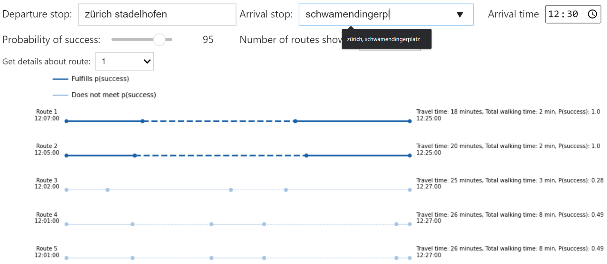
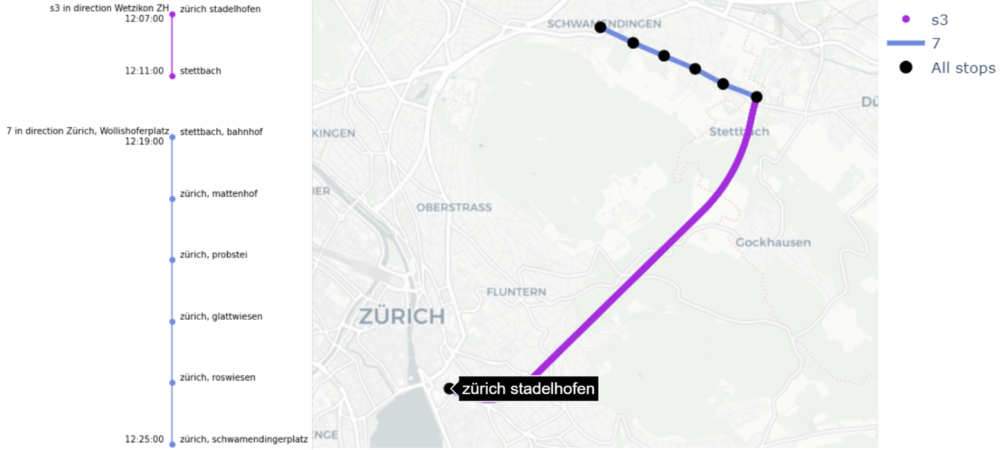
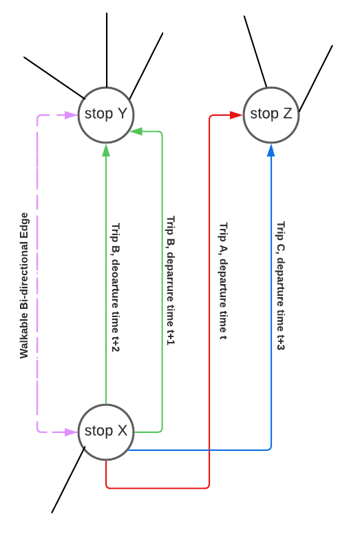
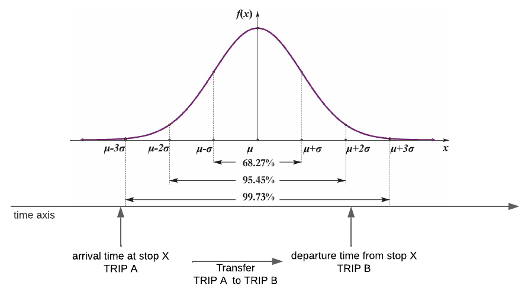

<!-- #region -->

# Robust Journey Planning

---

## Content

* [HOW-TO](#HOW-TO)
* [Overview](#Overview)
* [Data Processing](#Data-Processing)
* [Transport Network](#Transport-Network)
* [Routing Algorithm](#Routing-Algorithm)
* [Validation](#Validation)
* [Limitations](#Limitations)
* [Contributions](#Contributions)

---

## HOW-TO

A demo/advertisement video can be found at https://youtu.be/j-oMiJ1Bc5M.

In order to run the algorithm and to get the visualizations, open the notebook “you_can_try_it_here.ipynb”. It is stored in the "notebooks/" folder.

First, imports, network and necessary data must be loaded. In the chapter “Running algorithm” the input-data is asked, algorithm is run and visualizations are shown. Detailed instructions are available in the notebook itself. The result will be a input-interface and three visualization figures.



The remaining repository content is listed below.
The folder "notebooks/" contains:

- “you_can_try_it_here.ipynb” (As mentioned above)
- “validation_examples.ipynb”: This notebook shows how validation was implemented and includes some examples.

The folder “data-exploration/”: Includes all the work done during exploratory data analysis.

The folder “Processing/”: contains

- “construct_delay_tables.ipynb”: Creates tables about delays from Hive data.
- “construct_graph.ipynb”: Builds graph on which the algorithm is run.
- “data_processing.ipynb”: Contains preprocessing of data. More information can be found in the chapter [Data Processing](#Data-Processing).

The folder «modules/» has functions to run the notebooks mentioned above. It contains:

- «database.py»: Fetches delay information from cache. If not available, or forced to not retrieve from cache, it fetches data from Hive database and stores it in cache for faster retrieval.
- “hive_wrapper.py”: Has functions to establish a Hive connection, execute queries, retrieve query results as pandas DataFrames, and manages cache for query results. It also includes functions to create tables and reconnecting or closing the Hive connection.
- “route_planner.py”: Contains the robust-planner routing algorithm, which finds the shortest path between two nodes in a network graph using Dijkstra's algorithm. It computes the probability of success of the route by taking delay into consideration.
- “/trip_api.txt”: Has two API responses used for validation. Each response contains information about a train journey.
- “visualization.py”: Contains all functions related to visualization in order to build input-interface and to output three visualization figures.
- “utils.py”: Includes functions to retrieve environment variables for Hive server. A function to set up Spark configuration and other utility functions that do not fit into the categories mentioned above.

---

## Overview

The SBB app gives the user the shortest route between two stops. The problem is that if one train is late on the route, the user might miss the next transportation in the route.
Our solution is **robust planning**: we analyze past delay data from SBB to determine the probability of a route to fail.
The user can then base his decision to take a transportation based on this probability.

---

## Data Processing

At all times, we use the most recent file of March 2023.

#### stops (file: /data/sbb/orc/allstops)

- We keep only stops in 15 km area around Zürich HB station (lon=8.540192, lat= 47.378177). Therefore, our route planner can find only the routes such that all the stops are within this area, though a route between two consecutive stops go partly outside this perimeter.

#### stop_times (file: /data/sbb/part_orc/timetables/stop_times/year=2023/month=3/day=29)

We filtered:

- stop times between 6am and 10pm, for both departure and arrival times, since we assume that this range corresponds to reasonable working hours. Consequently, our route planner can find routes only in this time range.
- stop times where stop ID corresponds to a stop in the 15km area, since other stop times correspond to stops that our route planner will not use.

#### calendar (file: /data/sbb/part_orc/timetables/calendar/year=2023/month=3/day=29)

We dropped the services that are unavailable on all business days from Monday to Friday.

#### trips (file: /data/sbb/part_orc/timetables/trips/year=2023/month=3/day=29)

- We keep only only trips for which we have a service ID in our calendar
- We inner join this file with the stop times one to drop the trips for which stop times are unavailable in the selected perimeters, and to drop stop times for which we have no trips.
- **data limitation**: This operation is unavoidable, but what’s surprising about it is that the resulting number of trips with the corresponding stop times is even lower than the total number of distinct trips in the perimeter, knowing that the trip_id column in the stop_times file is non-unique. This proves that there is missing data in the stop_times file, and so our route planner cannot pick the trips for which the stop times are missing, given they were eliminated by this join operation.

#### routes: (file: /data/sbb/part_orc/timetables/routes/year=2023/month=3/day=29)

- We filter the routes that figure in the selected trips with available selected stop times
- We infer the transport type and subtype whenever possible from historical data based on the route name associated with each route.

### Inferring the transport type and subtype for each route using historical data

We base this inference on the following two files:

- /data/sbb/part_orc/istdaten
- /data/sbb/part_orc/timetables/routes/year=2023/month=3/day=29

In the istdaten file, we identify the following fields, translated or matched to their reasonable english counterparts based on observed data:

- produkt_id = transport_type
- verkehrsmittel_text = transport_subtype
- linien_text = route_name

We identify the transport types, and the subtypes associated to each type from the istdaten file. The transport type can be "train", "bus" or "tram". Two examples of transport subtypes for the type "train" would be "IC" and "IR".

We match each route, using its route name, with one to many istdaten historical entries based on the route name. However, we face two issues:

- issue 1: a route with a single transport type may have multiple subtypes, so we take the most frequent subtype.
- issue 2: a route can have multiple transport types, so we use the most frequent type with its corresponding most frequent subtype.

The reason we try to infer the route type is that the delay distribution for a given route will depend on the transport type and subtype if available.

---

## Transport Network

Using the processed trips, stop times and routes data, we build the transport network where:

- A node is a stop, characterized by its stop ID.
- An edge is either a walkable edge, in which case it is bi-directional, or a one-directional edge corresponding to a trip at a particular departure time of the day. Each edge is packed with its data necessary to run our algorithms like the scheduled arrival time to the next stop, the duration of the edge traversal, the walking time if the edge is walkable, ..etc

Here is a theoretical example:



---

## Estimation of Success Probability

We assume that the delay in any day period is normally distributed with some mean and standard deviation that are specific to the stop experiencing this delay and given a day period. We consider 5 day periods:

- morning (6:00 to 8:30)
- prenoon (8:30 to 12:00)
- afternoon (12:00 to 15:00)
- latenoon (15:00 to 18:00)
- evening (18:00 to 22:00)

For each stop and for each day period, we compute the mean and standard deviation of all the trips that arrive at that stop within that day period. Furthermore, we estimate those values also by transport type and subtype, providing more accurate and granular estimates for when the transport type only, or type and subtype together, are available.

To compute the probability of success of a route, we focus on the edges preceeding transfers (when the trip ID changes at some stop) or when reaching the destination. We denote by $P_{e_i}$ the most granular probability distribution for the delay random variable $D$ experienced at one such edge $e_i$, whose total number is denoted $n$. The level of granularity is determined by the presence of the transport subtype and type. We denote by $p_{R}$ the probability of success of the given route. Finally, we denote $\Delta t$ the maximum viable delay, which is the difference between the scheduled departure time of the next trip to be taken and the scheduled arrival time at the stop from which this next trip should be taken. Therefore:

$p_R = \prod_{i}^{n} P_{e_i}(D \leq \Delta t)$

The following figure illustrates this process at an edge where, at the next stop, the trip ID changes and so another transportation vehicule is taken.



Given the normal distribution is completely characterized by its mean and standard deviation, we can compute $P_{e_i}(D \leq \Delta t)$, and so we can compute $p_R$ for each route. One advantage of this approach aside from being farely realistic is that it does not slow down the algorithm by computing this probability at the same time as the shortest path as we will discuss in the next section.

---

## Routing Algorithm

The graph is reversed before being given to the algorithm.
Once the graph is constructed, given a source S, destination T, number of trips N and arrival A: we find N paths from S to T.
We return the shortest path and its probability of success using an adapted Dijkstra’s Algorithm.

The main changes over normal Dijkstra are:

- We iterate over outgoing edges instead of nodes
- We fix a minimum of 120 seconds transfer time necessary in transfers
- The shortest path is determined by the path with the latest departure time, then least walking time and finally least number of transfers.

For additional paths or until there are no more paths:

- Ban one or more path(s) from the previous paths found
- Rerun the algorithm preventing it from taking banned trips
- Return next shortest path

<div>
    
    
</div>

---

## Validation

Our approach is to compare our route planner to the official SBB route planner to check the viability of our solution, and observe the strength and weaknesses of our algorithmic approach.
In particular, we will use distance-based validation, including frequent stops or those commonly used by Zürich citizens. Additionally, we will consider stops that are evenly distributed across the median distance between stops, as well as stops located at the greatest distance from one another. You can find more details about the examples used and differences with SBB planner in the video presentation and this [notebook](./notebooks/validation_example.ipynb)

---

## Limitations

One limitation of the current approach is that we assume a fixed transfer time between connections. Indeed, transfer times can vary based on factors such as the specific station layout and passenger flow. By leveraging the transfers.txt file, we can enhance the accuracy of the route planner by considering actual transfer times, leading to more precise travel time estimates.

The current route planner is optimized for the general case, meaning that we assume a typical business day with reasonable operating hours. However, real travel scenarios can vary widely, including weekends and late-night travel. To provide more accurate routing solutions, it would be beneficial to incorporate more information about those specific time periods, accounting for changes in schedules.

The current delay computation method is based on average and standard deviation. While this approach provides a basic estimation of delays, it may not capture more complex factors that can influence travel times, such as traffic conditions or weather. By integrating other data sources, we can enhance the route planner's ability to adapt to changing conditions and provide more reliable travel time estimates.

The current code uses Dijkstra's algorithm to find the shortest path. While effective, it may encounter performance limitations when dealing with large-scale networks. To improve efficiency, alternative algorithms like A* or bidirectional search can be explored.

---

## Contributions

Farouk Boukil:

- Data Exploration
- Data Processing
- Transport Network Design
- Delay Estimation & Success Probability of Plans

Thomas Berkane:

- Data Exploration
- Data Preprocessing

Sophia Ly:

- Data Exploration
- Visualization

Henrique Da Silva Gameiro:

- Data exploration
- Data processing
- Graph design and construction

Omar El Malki:

- Data Exploration (Historical data)
- Data Preprocessing (Filter stops to support graph construction)
- Graph design and construction (one edge per trip, reversing edges)
- Routing Algorithm and Planner
- Video Direction and Editing

Nael Ouerghemi:

- Data Exploration
- Data Preprocessing
- Validation

<!-- #endregion -->

```python

```

